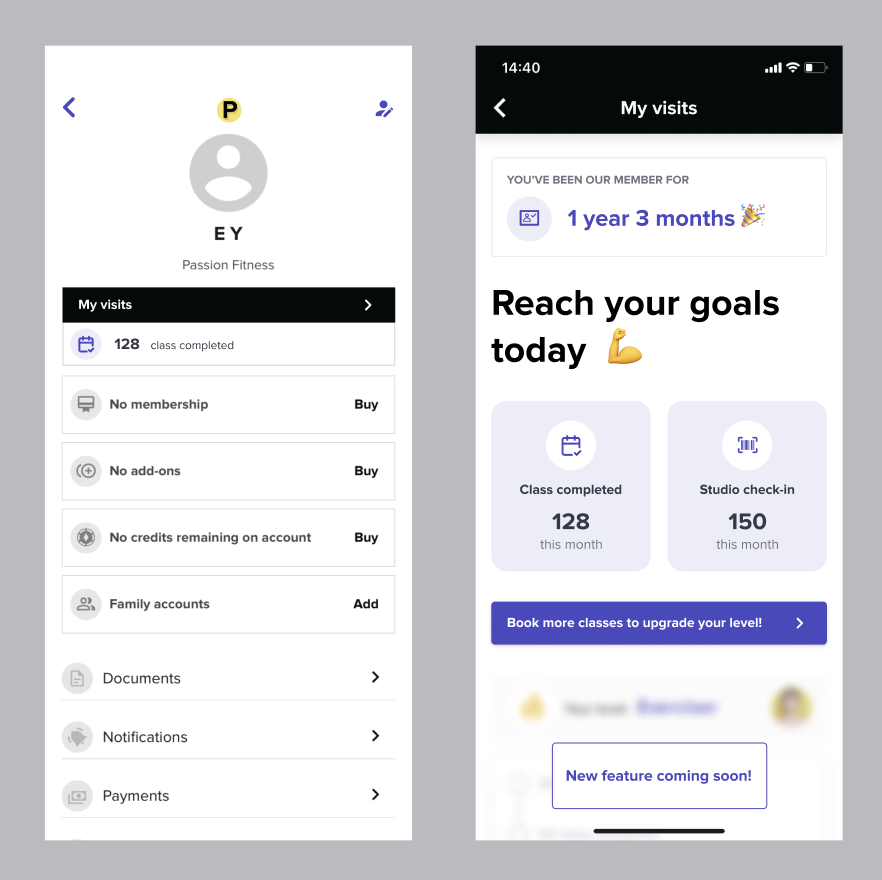

# Instructions

# Task 1 - Design decomposition - 15min
Adding a new feature always bring new challenges, one of the most common challenges we face as a team is how to slice something to deliver the biggest value for customers with the smallest amount of work.

This exercise asks the candidate to explore the different ways this piece of work could be approached.

Problem statement:

```
Members want to be able to see Visits and attendance inside the profile screen
```



# Task 2 - Complete the form! - 45min

Setup the environment together with the team member.


Goal:
```
Adapt the project to your own vision, shine!!
Feel free to delete, edit, move around anything.
```

This task is not intended to be completed, so no need to rush through it.

Considerations

- Input for a trainer field
    Data input has to be fetched from the API defined as `STAFF_ENDPOINT`

- Basic validations are contained in the config const

- Submit data to the API defined as `APPOINTMENT_ENDPOINT`

- Style the inputs!!, free to add whatever you think it looks good in a consistent reusable way.

